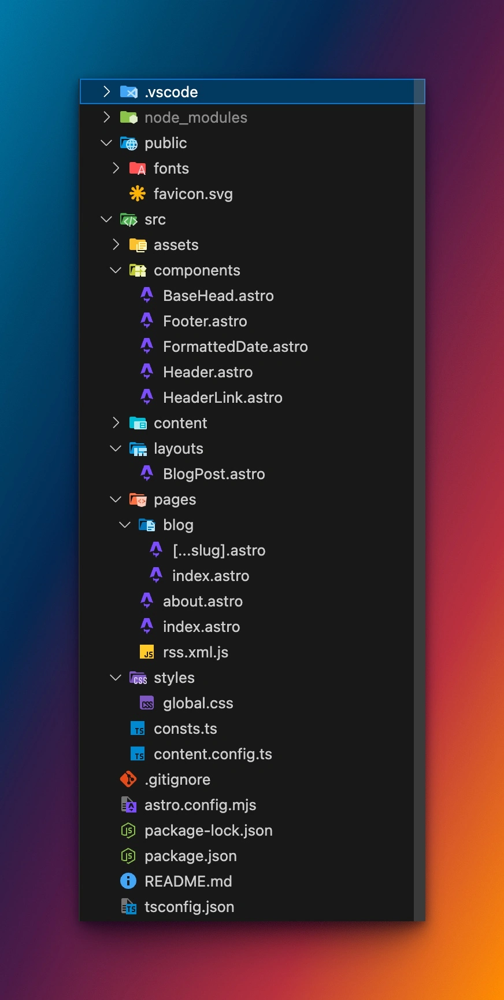

import { isProd } from '../../consts';

Astro est un framework moderne pour générer des sites statiques ultra performants. 

Je l'ai découvert quand j'ai voulu créer simplement ce blog.
Il permet de faire beaucoup plus de choses que juste des blogs statiques, mais il est vraiment parfait pour ça.

Dans cet article, tu vas donc apprendre à créer ton propre blog avec Astro, à personnaliser son apparence et à le préparer pour un déploiement rapide.

---

## Sommaire
- [Pré-requis](#pré-requis)
- [Initialiser le projet](#initialiser-le-projet)
- [Créer des articles](#créer-des-articles)
- [Personnaliser ton blog](#personnaliser-ton-blog)
- [Conclusion](#conclusion)

---

## Pré-requis

Avant de commencer :
- Installe **Node.js** (version 18+)
- Choisis ton éditeur (VS Code)


## Initialiser le projet

Dans ton terminal :
```bash
npm create astro@latest
```

Le ClI te posera quelques questions :
```bash
   dir   Where should we create your new project?
         ./shaggy-kuiper
```
Choisis un nom de dossier (ex. astro-blog) et appuie sur Entrée.
```bash
./astro-blog
```

Sélectionne le template "Use blog template" avec les flèches et appuie sur Entrée.
```bash
  tmpl   How would you like to start your new project?
         ○ A basic, helpful starter project 
         ● Use blog template 
         ○ Use docs (Starlight) template 
         ○ Use minimal (empty) template 
```
Le premier est pour un site vitrine, un portfolio, ou un projet où tu recherches une base fonctionnelle sans complexité.

Blog template est le template officiel d'Astro pour les blogs.

Starlight est spécifiquement conçu pour les docs, avec des fonctionnalités comme la hiérarchie des pages, les versions, etc.

Enfin le dernier est pour les développeurs qui veulent tout configurer manuellement (ex : intégration avec un CMS, un design custom, ou une stack spécifique).

Ensuite on peut déjà run l'app:

```bash
npm install
npm run dev
```

Ton site sera accessible sur http://localhost:4321.

## Créer des articles

Rien de plus simple comme tout est statique et basé sur du Markdown.
Soit vous voulez créer un article en `.md` ou en `.mdx` (Markdown + JSX) alors cela se passe dans le dossier `src/content/blog/`.
Sinon vous pouvez aussi créer des pages statiques dans `src/pages/`.
    
Chaque article est un fichier Markdown (.md ou .mdx).
Exemple :

```mdx
---
title: 'First post'
description: 'Lorem ipsum dolor sit amet'
pubDate: 'Jul 08 2022'
heroImage: '../../assets/blog-placeholder-3.jpg'
---

Bienvenue sur mon premier article avec Astro !
```

## Personnaliser ton blog

Pour la personnalisation, elle est infini comme c'est du code: 
<ul>
    <li>Tu peux utiliser des composants React, Svelte, Vue, etc. directement dans tes fichiers `.mdx`.</li>
    <li>Tu peux modifier le layout global dans `src/layouts/` et les composants dans `src/components/`.</li>
    <li>Tu peux aussi modifier le style global dans `src/styles/` ou utiliser des frameworks CSS comme Tailwind CSS.</li>
    <li>Tu peux aussi ajouter des fonctionnalités comme la recherche, les tags, la pagination, etc.</li>
    <li>Tu peux utiliser des plugins comme Starlight Blog ou i18n.</li>
</ul>



## Conclusion

Pour aller plus loin, tu peux vouloir le mettre en production avec un CI/CD via GitHub Actions.
J'ai écrit un article complet à ce sujet : <a href={isProd ? '/blog/blog/astro-cicd-github/' : '/blog/astro-cicd-github/'}>Astro & GitHub Actions — CI/CD simplifié</a>.

Sinon voici encore quelques ressources utiles pour continuer ton aventure avec Astro :

Documentation Astro officielle : [https://docs.astro.build](https://docs.astro.build)

Deploiement avec GitHub Pages : [Astro + GitHub Pages](https://docs.astro.build/en/guides/deploy/github/)